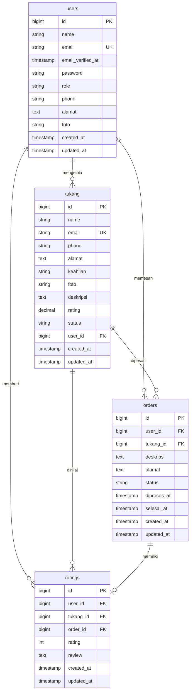

# Tukang-On

Aplikasi mobile untuk mencari dan memesan tukang servis terpercaya di sekitar Anda.

## Fitur

- Cari tukang berdasarkan keahlian dan lokasi
- Pesan jasa tukang online
- Beri rating dan review setelah servis selesai
- Notifikasi WhatsApp untuk update status pesanan
- Dashboard admin untuk manajemen tukang
- Autentikasi JWT yang aman

## Arsitektur

| Komponen | Teknologi |
|----------|-----------|
| Frontend Mobile | Flutter 3.29.2 |
| Backend API | Laravel 13 |
| Database | MySQL / MariaDB |
| Autentikasi | JWT (tymon/jwt-auth) |
| Notifikasi | WhatsApp API (Fonnte) |

## Entity Relationship Diagram



## Branch

| Branch | Isi |
|--------|-----|
| `main` | Dokumentasi + Flutter + Laravel |
| `mobile` | Aplikasi Flutter |
| `backend` | REST API Laravel |

## Cara Menjalankan

### Backend

```bash
cd backend
cp .env.example .env
# isi config database dan JWT
composer install
php artisan migrate
php artisan serve --host=0.0.0.0 --port=8000
```

### Frontend (Mobile)

```bash
# setup environment
source env.sh
flutter pub get
flutter run
```

## Lisensi

Hak cipta dilindungi undang-undang.
