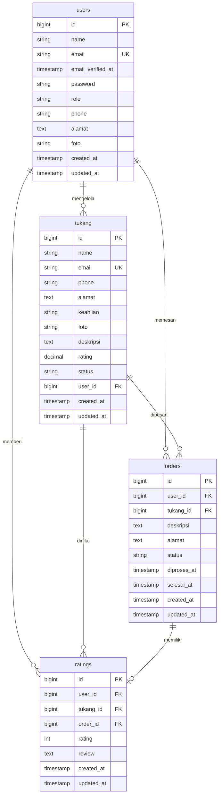

# Tukang-On API

REST API backend untuk aplikasi Tukang-On -- platform pencarian dan pemesanan tukang servis.

## Fitur

- Autentikasi JWT (register, login, logout)
- Manajemen profil pengguna
- CRUD data tukang
- Pemesanan jasa tukang
- Rating dan review setelah servis
- Dashboard admin
- Notifikasi WhatsApp (Fonnte API)

## Tech Stack

| Komponen | Teknologi |
|----------|-----------|
| Framework | Laravel 13 |
| Database | MySQL / MariaDB |
| Auth | JWT (tymon/jwt-auth) |
| WA Notif | Fonnte API |

## Entity Relationship Diagram



## API Endpoints

| Method | Endpoint | Auth | Deskripsi |
|--------|----------|------|-----------|
| POST | /api/register | No | Register akun |
| POST | /api/login | No | Login |
| GET | /api/me | Yes | Profil user |
| POST | /api/logout | Yes | Logout |
| PUT | /api/profile | Yes | Update profil |
| GET | /api/tukang | Yes | List tukang |
| POST | /api/tukang | Yes | Tambah tukang |
| GET | /api/tukang/{id} | Yes | Detail tukang |
| PUT | /api/tukang/{id} | Yes | Update tukang |
| DELETE | /api/tukang/{id} | Yes | Hapus tukang |
| GET | /api/orders | Yes | List pesanan |
| POST | /api/orders | Yes | Buat pesanan |
| PUT | /api/orders/{id}/status | Yes | Update status |
| GET | /api/ratings | Yes | List rating |
| POST | /api/ratings | Yes | Beri rating |
| GET | /api/dashboard | Yes | Dashboard |

## Cara Menjalankan

```bash
cp .env.example .env
# isi config database, JWT_SECRET, FONNTE_API_KEY
composer install
php artisan key:generate
php artisan jwt:secret
php artisan migrate
php artisan serve --host=0.0.0.0 --port=8000
```

## Lisensi

Hak cipta dilindungi undang-undang.
